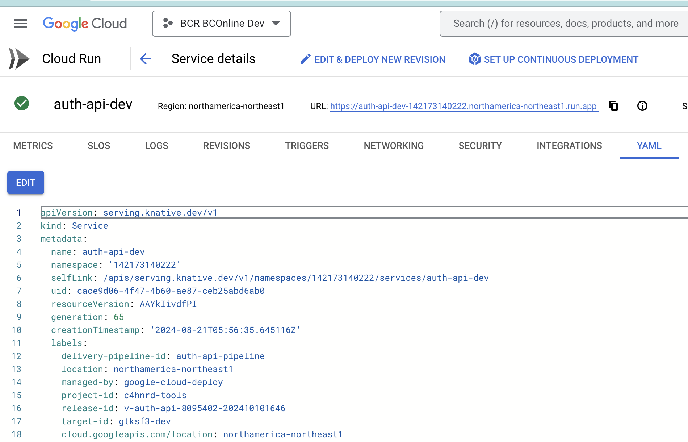
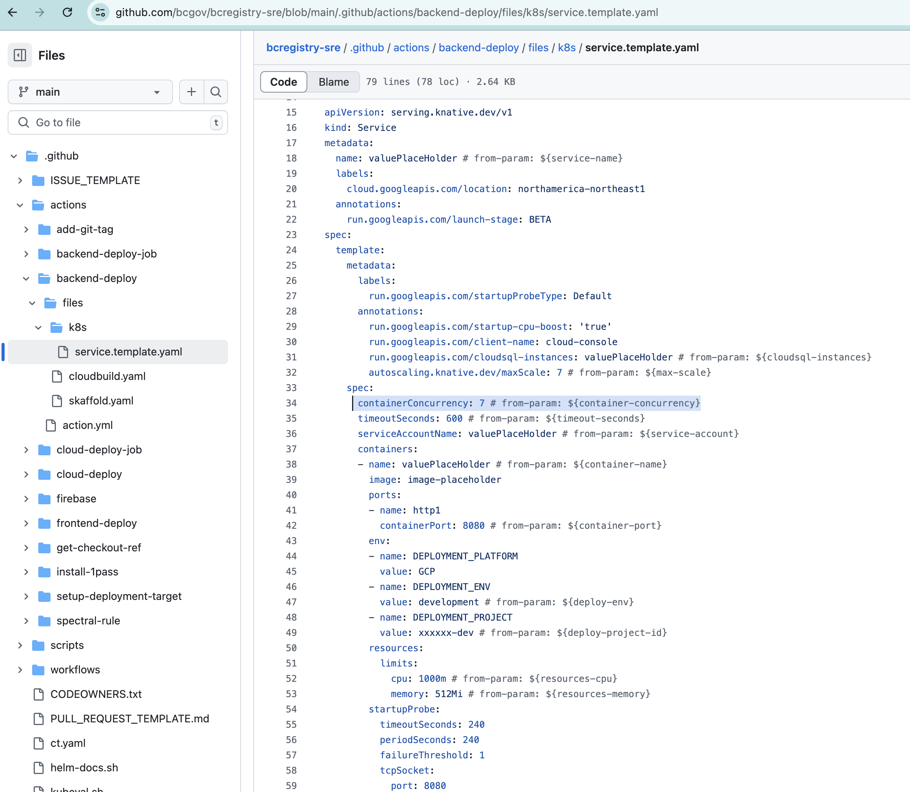
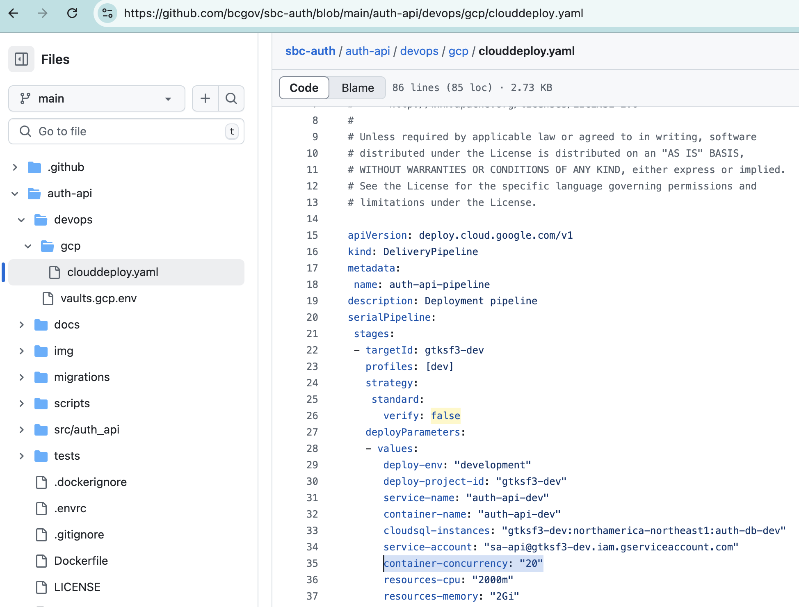
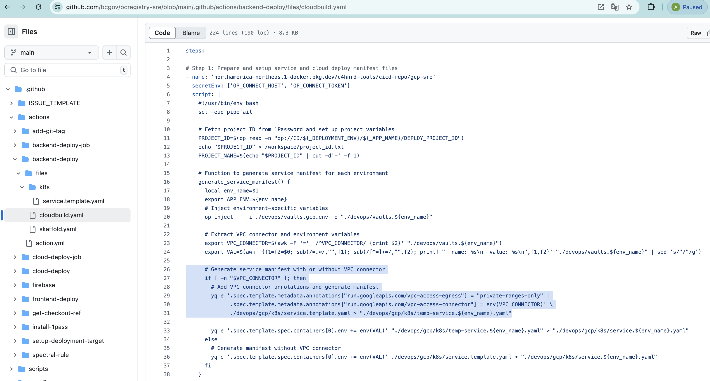

***Projects in Google Cloud need the following items setup:***

- network
- logging sink
- alert
- cloud run service cpu/memory
- product db replica/backup/zones

***CloudRun Template***

(cloud run service cpu/memory)

When exploring CloudRun view in Google Cloud Console you can examine a yaml file representing the CloudRun resource.

Current CD (Continuous Delivery) pipelines takes advantage of CloudRun Templates, which are used to generate CloudRun resource at deployment.

The values for template parameters are defined in devops/gcp/clouddeploy.yaml file.

(network)

Another mechanism through which some parameters might enter the template is via bash script in cloudbuild.yaml file that reads 1password variables and inserts them into the CloudRun Template.

For example, VPC_CONNECTOR variable can be defined in 1password and devops/vaults.gcp.env file.

VPC Connector enables CloudRun to use Shared Virtual Private Cloud networks defined in Registries' Common-... projects. You can read more about the function of VPC Connector in [GCP docs](https://cloud.google.com/vpc/docs/serverless-vpc-access)

***gcloud scripts***

There is a number of scripts that can be used as a starting point to create GCP resources.
You will need to populate some variables in order to run these scripts, i.e. TARGET_PROJECT_ID (your project nameplate), ENV (e.g., dev/test/prod/tools), TAG (e.g., dev/test/prod/sandbox)

- (logging sink / alerts)

  ../gcp_infra.sh

  The script creates an 'error' log sink and loads alert policies from alert_policies directory (which contains sample alerting policies).

- (product db replica/backup/zones)

  ../gcp_cloudsql_instance.sh

- (network)

  ../gcp_permissions.sh

  The script contains contains a few permissions/settings that need to be configured before CloudRun can use VPC Connector.
