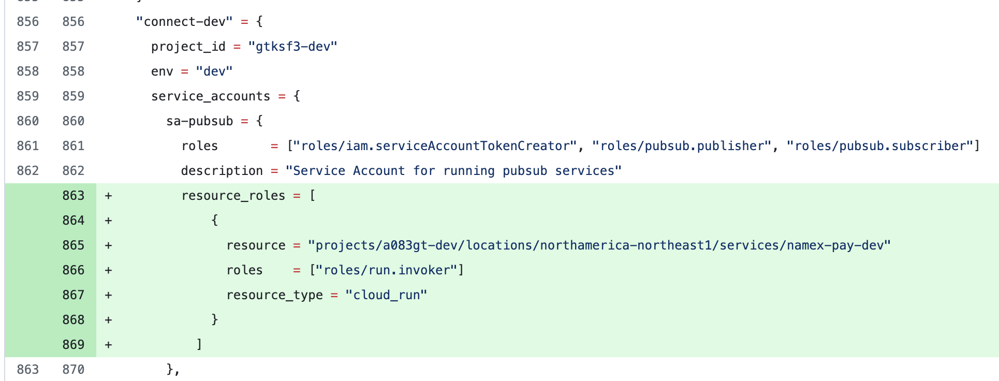

# Updating Terraform Configuration for Google Cloud's Custom Roles and Service Accounts

## Prerequisites
Before updating Terraform configuration, ensure you have the following:

- A working Terraform setup (`terraform` CLI installed)
- Access to the repository where the Terraform configuration is stored
- Appropriate permissions to push changes and apply Terraform updates
- Configured backend (if using remote state management)

## Steps to Update Terraform Configuration

1. Clone the Repository
2. Create a New Branch
3. Modify Terraform Configuration in `terraform.tfvars` file

- There are three variable files that can be modified:

`project_account_bindings.auto.tfvars`

  1) projects -  a list of GCP projects, where each project consists of:

    project_id       = ...  # Unique ID for the project
    env              = ...  # Environment (e.g., dev, prod)

    service_accounts = ...  # List of service accounts, where each account has
      roles                 # List of IAM roles assigned to the service account
      description           # Description of the service account

      external_roles        # List of roles in other projects (i.e. not the current project), where each entry has
        roles               # List of roles granted on an external project
        project_id          # Project where the roles are granted

      resource_roles        # List of resource specific roles, where each entry has
        resource            # Specific resource URI (e.g., bucket, topic) the role applies to
        roles               # List of roles assigned to the resource
        resource_type       # Type of resource (e.g., storage_bucket, pubsub_topic, arifact_registry, sa_iam_member)

    custom_roles     = ...  # List of custom roles in the project
      title                 # Name of the custom IAM role
      permissions           # List of permissions assigned to the role
      description           # Description of the custom role

For example, if you want to grant sa-pubsub service account in Connect Dev an invoker role for Cloud Run in Business Dev:

`environment_custom_roles.auto.tfvars`

  2) environments - a list of environments with their corresponding environment_custom_roles

    environment_custom_roles   # List of custom roles shared across all projects in the environment
      title                    # Name of the custom IAM role
      permissions              # List of permissions assigned to the role
      description              # Description of the custom role

`global_custom_roles.auto.tfvars`

  3) global_custom_roles -  a list of global custom roles shared across all projects

    title                 # Name of the custom IAM role
    permissions           # List of permissions assigned to the role
    description           # Description of the custom role
4. Merging the new branch into main will trigger 'terraform plan'
5. Output of terraform plan can be reviewed in https://app.terraform.io/app/BCRegistry/workspaces/gcp-iam/runs
6. If no errors are present, and if Terraform state changes are as expected, 'terraform apply' can be executed for the run in the UI (will either need permissions to access or ask SRE team to review)
